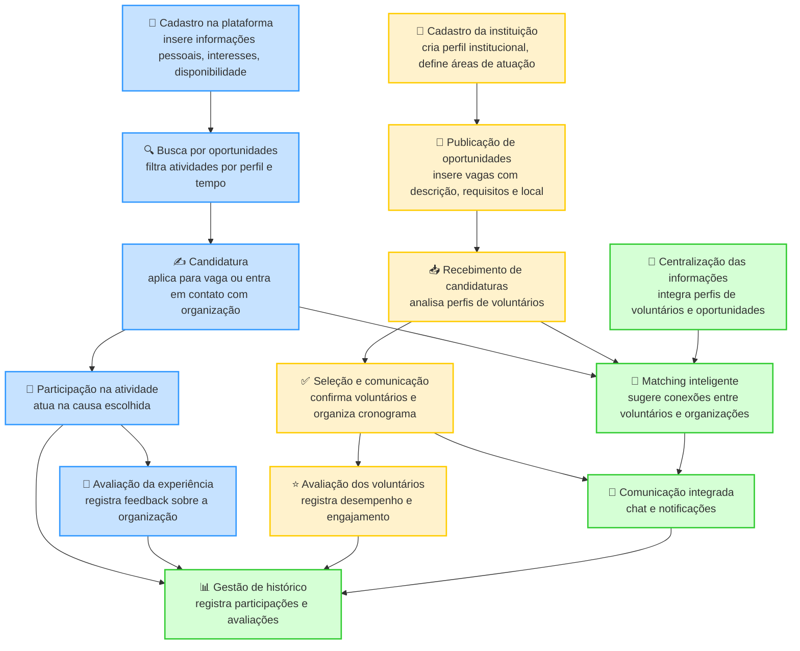
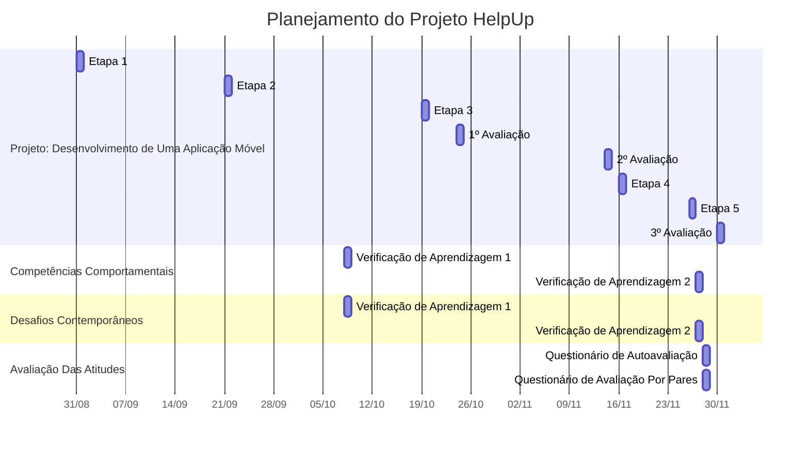

# Especificações do Projeto
## Personas

|Imagem    | Nome  | Descrição |
|------|-----------------------------------------|----|
|| **Pedro Almeida** | **Idade**: 22 anos; **Localização**: Rio de Janeiro; **Perfil**: Estudante de Engenharia que sonha em seguir a carreira acadêmica na área de matemática.; **Dores**: Não tem experiência em sala de aula ou com ensino formal/informal, além da dificuldade de encontrar alunos empenhados.; **Expectativa**: Encontrar uma plataforma onde possa elaborar um perfil e atrair ofertar serviços de ensino em matemática. Além disso, deseja acessar a mesma plataforma para se conectar com organizações/professores referência na área. |
|| **Maria Oliveira** | **Idade**: 35 anos; **Localização**: São Paulo; **Perfil**: Coordenadora de uma ONG voltada para apoio a famílias em situação de vulnerabilidade.; **Dores**: Dificuldade em divulgar oportunidades de voluntariado de forma ampla e atrair pessoas com disponibilidade de tempo.; **Expectativa**: Ter acesso a uma plataforma que centralize voluntários dispostos a ajudar, permitindo cadastrar atividades de forma clara e encontrar rapidamente candidatos adequados. |
|| **João Ferreira** | **Idade**: 28 anos; **Localização**: Belo Horizonte; **Perfil**: Profissional de TI interessado em dedicar parte do tempo livre a projetos sociais relacionados à tecnologia e inclusão digital.; **Dores**: Falta de informações organizadas sobre projetos que utilizem suas habilidades técnicas, além de dificuldade em conciliar agenda de trabalho e voluntariado.; **Expectativa**: Encontrar oportunidades flexíveis que valorizem suas competências, especialmente em projetos de capacitação digital e ensino de informática básica. |
|| **Ana Souza** | **Idade**: 42 anos; **Localização**: Curitiba; **Perfil**: Diretora de uma instituição de ensino comunitária que oferece reforço escolar gratuito para jovens.; **Dores**: Escassez de voluntários capacitados para atender à demanda, especialmente em disciplinas de exatas e idiomas.; **Expectativa**: Usar uma plataforma para recrutar professores voluntários, acompanhar o desempenho das atividades e fortalecer a rede de colaboradores da instituição. |
|| **Lucas Mendes** | **Idade**: 19 anos; **Localização**: Salvador; **Perfil**: Universitário do curso de Administração, motivado a contribuir em projetos sociais e adquirir experiência prática para sua carreira.; **Dores**: Dificuldade em encontrar oportunidades próximas à sua região que conciliem com os horários da universidade.; **Expectativa**: Descobrir projetos que se alinhem com sua rotina, ao mesmo tempo em que desenvolve habilidades de gestão e liderança em ações voluntárias. |
|| **Helena Carvalho** | **Idade**: 50 anos; **Localização**: Porto Alegre; **Perfil**: Gestora de um abrigo de animais que depende do trabalho de voluntários para manutenção e cuidados diários.; **Dores**: Falta de mão de obra constante, alta rotatividade de voluntários e pouco alcance das campanhas de divulgação.; **Expectativa**: Encontrar voluntários engajados e dispostos a contribuir de forma contínua, além de contar com uma plataforma que facilite comunicação e organização das tarefas. |

## Histórias de Usuários

| EU COMO... | QUERO/PRECISO...                                                                                | PARA...                                                                                                 |
|------------|-------------------------------------------------------------------------------------------------|---------------------------------------------------------------------------------------------------------|
| Voluntário | Criar um perfil pessoal com minhas habilidades, interesses e disponibilidade de tempo           | que as organizações encontrem meu perfil e para receber sugestões de vagas compatíveis.                 |
| Voluntário | Buscar e filtrar oportunidades de voluntariado por localização, causa, tipo de atividade e data | encontrar de forma rápida e fácil uma oportunidade que se alinhe com meus interesses e disponibilidade. |
| Voluntário | Me candidatar a uma oportunidade de voluntariado diretamente pelo aplicativo                    | simplificar o processo de inscrição e centralizar minhas candidaturas em um só lugar.                   |
| Voluntário | Me comunicar com a organização através de um chat ou sistema de mensagens                       | tirar dúvidas, coordenar os detalhes da atividade e confirmar minha participação.                       |
| Voluntário | Receber notificações sobre o status das minhas candidaturas e novas oportunidades               | me manter atualizado e não perder nenhuma chance de contribuir.                                         |
| Voluntário | Avaliar a organização e a experiência de voluntariado após a conclusão da atividade             | ajudar outros voluntários a tomarem decisões e oferecer um feedback construtivo para a instituição.     |
| Voluntário | Ter um histórico de todas as minhas participações e avaliações recebidas                        | construir um registro do meu engajamento social e compartilhar minha experiência.                       |
| Organização | Cadastrar, publicar, editar e gerenciar oportunidades de voluntariado de forma autônoma          | alcançar um público maior de potenciais voluntários e ter controle total sobre minhas vagas.    |
| Organização | Definir critérios específicos, como habilidades necessárias, prazos e localização para cada vaga | garantir que encontrarei os voluntários mais adequados para as necessidades da minha causa.     |
| Organização | Visualizar o perfil dos voluntários que se candidataram às minhas oportunidades                  | analisar suas habilidades e experiências para selecionar os candidatos ideais para a vaga.      |
| Organização | Me comunicar diretamente com os voluntários (individualmente ou em grupo)                        | alinhar expectativas, enviar informações importantes e organizar a logística das atividades.    |
| Organização | Monitorar o progresso das atividades e confirmar a participação dos voluntários                  | ter uma gestão mais eficiente das minhas ações e garantir que os objetivos sejam cumpridos.     |
| Organização | Avaliar os voluntários após a conclusão de uma atividade                                         | reconhecer seu esforço, fornecer feedback e ajudar a construir a reputação deles na plataforma. |
| Organização | Ter um perfil público com o histórico de atividades realizadas e avaliações recebidas            | aumentar a credibilidade da minha instituição e atrair mais voluntários engajados.              |

## Modelagem do Processo de Negócio 
### Legenda do Diagrama

- 🟦 **Azul**: Voluntário  
- 🟨 **Amarelo**: Organização  
- 🟩 **Verde**: Plataforma (Help Up)

## Indicadores de Desempenho

| Indicador | Objetivos | Descrição | Cálculo | Fonte de Dados | Perspectiva |
|-----------|-----------|-----------|---------|----------------|-------------|
| Taxa de Engajamento de Voluntários | Medir o nível de participação ativa | Percentual de voluntários que se inscreveram e participaram de pelo menos uma atividade | (Voluntários ativos / Total de voluntários cadastrados) x 100 | Tabela Voluntarios, Tabela Atividades | Usuário/Voluntário |
| Tempo Médio de Resposta das Organizações | Avaliar agilidade na comunicação | Tempo médio entre a candidatura de um voluntário e a resposta da organização | Média de horas entre candidatura e resposta | Tabela Candidaturas, Tabela Organizacoes | Processos/Organização |
| Taxa de Preenchimento de Vagas | Medir eficiência da captação | Percentual de vagas de voluntariado preenchidas em relação ao total publicado | (Vagas preenchidas / Vagas publicadas) x 100 | Tabela Oportunidades | Processos/Organização |
| Satisfação dos Voluntários | Avaliar qualidade da experiência | Média de avaliações dadas pelos voluntários após participação nas atividades | Média de notas de 1 a 5 | Tabela Avaliacoes | Cliente/Voluntário |
| Matching Efetivo | Medir acerto da plataforma | Percentual de voluntários que se candidataram a oportunidades recomendadas pelo sistema | (Candidaturas em oportunidades recomendadas / Total de candidaturas) x 100 | Tabela Recomendacoes, Tabela Candidaturas | Sistema/Tecnologia |

## Requisitos

As tabelas que se seguem apresentam os requisitos funcionais e não funcionais que detalham o escopo do projeto.

### Requisitos Funcionais

|ID    | Descrição do Requisito  | Prioridade |
|------|-----------------------------------------|----|
|RF-001| A aplicação deverá conter uma tela inicial com formulário de cadastro e login.| Alta |
|RF-002| Os usuários possuem o controle de editar suas informações pessoais na aba de Configurações. | Alta |
|RF-003| Os usuários conseguem visualizar sua página de Perfil com todas as suas informações salvas. | Alta |
|RF-004| A aplicação deve permitir que uma organização crie novas oportunidades de trabalho voluntário. | Alta |
|RF-005| O sistema deverá permitir que as organizações visualizem candidaturas recebidas. | Alta |
|RF-006| O sistema deve permitir que os voluntários visualizem e se candidatem as vagas disponíveis. | Alta |
|RF-007| O sistema deve permitir que os voluntários visualizem suas candidaturas enviadas. | Alta |
|RF-008| A aplicação deve conter um fórum geral de discussão com perguntas e respostas. | Média |
|RF-009| O sistema deve permitir que usuários possam avaliar ONG'S. | Média |
|RF-010| O sistema possibilitará o usuário de obter uma conta Premium. | Alta |

### Requisitos Não Funcionais

|ID    | Descrição do Requisito  | Prioridade |
|------|-----------------------------------------|----|
|RNF-001| A interface deve ser simples e de fácil utilização, permitindo que qualquer usuário navegue sem dificuldades. | Alta | 
|RNF-002| O sistema deve reagir às ações do usuário sem atrasos perceptíveis.| Média |
|RNF-003| O aplicativo deve ser compatível em dispositivos Android (versão mobile). | Alta |
|RNF-004| Todas as senhas devem ser armazenadas de forma criptografada. | Alta |
|RNF-005| O sistema deve estar acessível para uso sempre que o usuário precisar, salvo em casos de manutenção planejada. | Média |

## Restrições

O projeto está restrito pelos itens apresentados na tabela a seguir.

|ID| Restrição                                             |
|--|-------------------------------------------------------|
|01| O projeto deverá ser entregue até o final do semestre |
|02| Não será desenvolvido um módulo de backend, optando pelo uso do JSONServer|
|03| O escopo do projeto será limitado a um produto viável mínimo|
|04| A maior parte da lógica de negócio será executada no dispositivo do usuário|

## Diagrama de Casos de Uso

# Matriz de Rastreabilidade

| Requisito | Cadastro/Login | Perfil | Atividades | Candidaturas | UI/UX | Segurança | Disponibilidade |
|-----------|----------------|--------|------------|--------------|-------|-----------|----------------|
| RF-001 | ✔️ |  |  |  | ✔️ |  |  |
| RF-002 | ✔️ |  |  |  |  |  |  |
| RF-003 | ✔️ |  |  |  |  | ✔️ |  |
| RF-004 |  | ✔️ | ✔️ |  | ✔️ |  |  |
| RF-005 |  |  | ✔️ |  |  |  |  |
| RF-006 |  | ✔️ |  | ✔️ |  |  |  |
| RF-007 |  | ✔️ | ✔️ |  | ✔️ |  |  |
| RF-008 |  |  |  |  |  | ✔️ |  |
| RNF-001 |  | ✔️ | ✔️ | ✔️ | ✔️ |  |  |
| RNF-002 |  | ✔️ | ✔️ | ✔️ | ✔️ |  |  |
| RNF-003 | ✔️ | ✔️ | ✔️ | ✔️ | ✔️ |  |  |
| RNF-004 |  |  |  |  |  | ✔️ |  |
| RNF-005 |  |  |  |  |  |  | ✔️ |

# Gerenciamento de Projeto
## Gerenciamento de Tempo

# Modelo de Negócio (Free x Premium)

### Plano Free

**Usuários:**
- Criam perfil e se candidatam às vagas disponíveis.  
- Visualizam vagas abertas em ordem padrão.  

**ONGs:**
- Podem publicar vagas gratuitamente.  
- Recebem candidaturas em volume normal (sem destaque especial).  

### Plano Premium

**Usuários:**
- Ganham **mais visibilidade** nas candidaturas (perfis aparecem primeiro para ONGs).  
- Possibilidade de receber recomendações personalizadas de vagas.  
- Badge de "voluntário premium" no perfil.

**ONGs:**
- **Maior exposição** das vagas publicadas (aparecem em destaque e no topo das buscas).  
- Ferramentas adicionais (ex.: estatísticas de visualizações e candidaturas).  
- Comunicação direta com voluntários interessados.  

## Estrutura de Receita

Receita baseada em **assinatura premium**:  

- **Usuários:** plano mensal/anual (valor acessível para não restringir participação social).  
- **ONGs:** assinatura institucional (com preços diferenciados de acordo com porte da ONG).  
